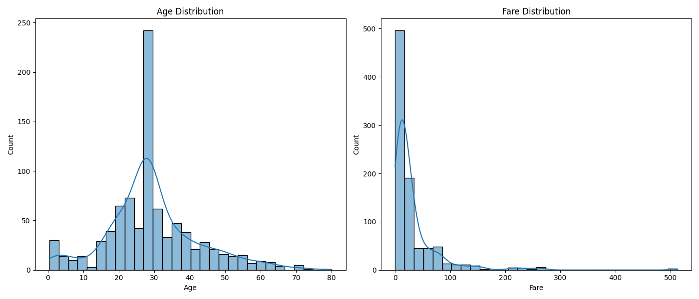
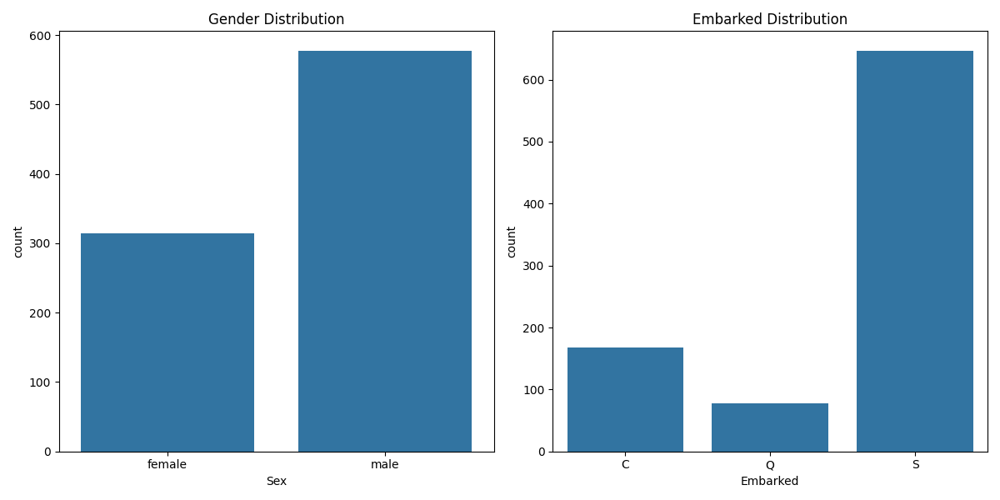
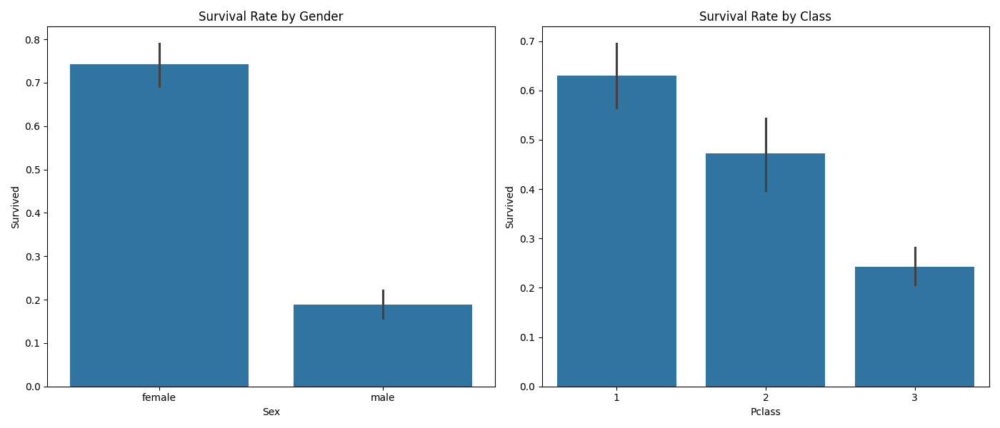
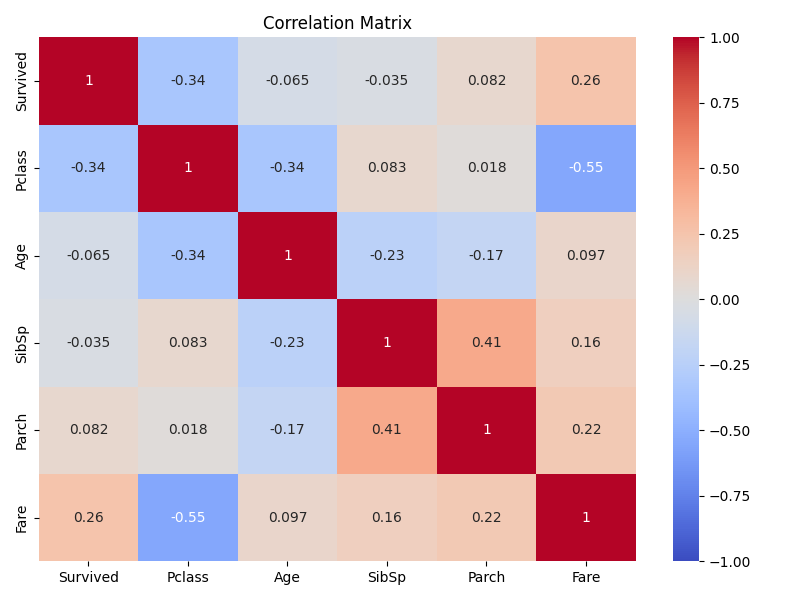
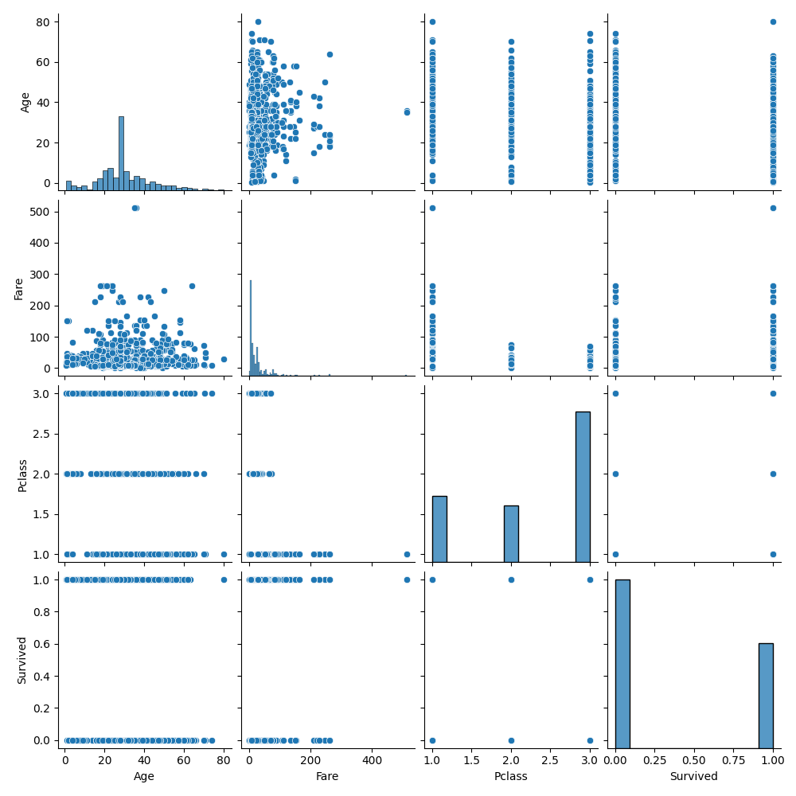

# Data Science Task 02: Titanic Dataset - Data Cleaning & Exploratory Data Analysis (EDA)

## Overview
In this project, I performed **data cleaning** and **exploratory data analysis (EDA)** on the Titanic dataset. The dataset is widely used in machine learning and data analysis tasks and is publicly available on Kaggle.

Through this project, we aim to understand patterns in passenger data, particularly factors affecting survival. Visualizations are used to explore relationships between variables.

The dataset used in this project is publicly available:

- Dataset: [Kaggle - Titanic: Machine Learning from Disaster](https://www.kaggle.com/c/titanic/data)

---

## Objective
The objective of this project is to:

- Load and preprocess the Titanic dataset.
- Handle missing values and clean the data.
- Explore and visualize distributions of numerical and categorical variables.
- Analyze survival patterns based on different passenger features (gender, class, etc.).
- Save all generated visualizations for reporting and insights.

---

## Steps to Execute

1. **Clone the Repository**:  
   Clone this repository to your local machine using the following command:
   ```bash
   git clone https://github.com/Shreyabagal/PRODIGY_DS_02.git
   ```

2. **Install Dependencies**:  
   Install the required Python libraries using `pip`. Use the provided `requirements.txt`:
   ```bash
   pip install -r requirements.txt
   ```

3. **Run the Script**:  
   Execute the Python script to perform EDA and generate plots:
   ```bash
   python titanic_eda.py
   ```

4. **Output**:  
   After execution, multiple `.png` files containing the plots will be saved in the `Images/` directory.

---

## Visualizations

The following visualizations are generated and saved in the `Images/` folder:

### 1. Age & Fare Distribution


---

### 2. Gender and Embarked Distribution


---

### 3. Survival Rate by Gender and Class


---

### 4. Correlation Heatmap


---

### 5. Pairplot of Numerical Features


---

## Explanation of the Code

The Python script (`titanic_eda.py`) performs the following:

1. **Data Loading**: Loads training and test data from CSV files.
2. **Data Cleaning**: Handles missing values, drops irrelevant columns, and converts data types.
3. **EDA & Visualization**:
   - Histograms of numerical features (Age, Fare)
   - Count plots of categorical features (Sex, Embarked)
   - Bar plots of survival rates by gender and class
   - Heatmap of correlations
   - Pairplot of numerical features

All plots are saved in the `Images/` folder.

---

## Technologies Used
- Python
- Pandas
- NumPy
- Matplotlib
- Seaborn

---

## File Structure

```
PRODIGY_DS_02/
├── train.csv                      # Training dataset
├── test.csv                       # Test dataset
├── titanic_eda.py                # Main Python script
├── requirements.txt              # Python dependencies
├── README.md                     # Project documentation
├── Image/
│   ├── age_fare_distribution.png
│   ├── sex_embarked_distribution.png
│   ├── survival_rate_analysis.png
│   ├── correlation_matrix.png
│   └── pairplot.png
```

---

